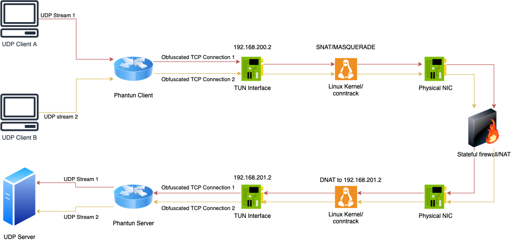

# Phantun

A lightweight and fast UDP to TCP obfuscator.

Table of Contents
=================

* [Phantun](#phantun)
* [Overview](#overview)
* [Usage](#usage)
    * [Enable Kernel IP forwarding](#enable-kernel-ip-forwarding)
    * [Add required firewall rules (using nftables as an example)](#add-required-firewall-rules-using-nftables-as-an-example)
        * [Client](#client)
        * [Server](#server)
    * [Give Phantun binaries required capability to it can be run as non-root (Optional)](#give-phantun-binaries-required-capability-to-it-can-be-run-as-non-root-optional)
    * [Start](#start)
        * [Server](#server)
        * [Client](#client)
* [MTU overhead](#mtu-overhead)
* [Version compatibility](#version-compatibility)
* [Compariation to udp2raw](#compariation-to-udp2raw)
* [License](#license)

# Overview

Phanton is a project that obfuscated UDP packets into TCP connections. It aims to
achieve maximum performance with minimum processing and encapsulation overhead.

It is commonly used in environments where UDP is blocked/throttled but TCP is allowed through.

Phanton simply converts a stream of UDP packets into obfuscated TCP stream packets. The TCP stack
used by Phantun is designed to pass through most L3/L4 stateful/stateless firewalls/NAT
devices. It will **not** be able to pass through L7 proxies.
However, the advantage of this approach is that none of the common UDP over TCP performance killer
such as retransmissions and flow control will occur. The underlying UDP properties such as
out-of-order delivery are fully preserved even if the connection ends up looking like a TCP
connection from the perspective of firewalls/NAT devices.



# Usage

Phantun creates TUN interface for both the Client and Server. For Client, Phantun assigns itself the IP address
`192.168.200.2` and for Server, it assigns `192.168.201.2`. Therefore, your Kernel must have
`net.ipv4.ip_forward` enabled and setup appropriate iptables rules for NAT between your physical
NIC address and Phantun's TUN interface address.

## Enable Kernel IP forwarding

Edit `/etc/sysctl.conf`, add `net.ipv4.ip_forward=1` and run `sudo sysctl -p /etc/sysctl.conf`.

[Back to TOC](#table-of-contents)

## Add required firewall rules (using nftables as an example)

### Client

Client simply need SNAT enabled on the physical interface to translate Phantun's address into
one that can be used on the physical network. This can be done simply with masquerade.

Note: change `eth0` to whatever actual physical interface name is

```
table inet nat {
    chain postrouting {
        type nat hook postrouting priority srcnat; policy accept;
        iifname tun0 oif eth0 masquerade
    }
}
```

[Back to TOC](#table-of-contents)

### Server

Server needs to DNAT the TCP listening port to Phantun's TUN interface address.

Note: change `eth0` to whatever actual physical interface name is and `4567` to
actual TCP port number used by Phanton server

```
table ip nat {
    chain prerouting {
        type nat hook prerouting priority dstnat; policy accept;
        iif eth0 tcp dport 4567 dnat to 192.168.201.2
    }
}
```

[Back to TOC](#table-of-contents)

## Give Phantun binaries required capability to it can be run as non-root (Optional)

It is ill-advised to run network facing applications as root user. Phantun can be run fully
as non-root user with the `cap_net_admin` capability.

```
sudo setcap cap_net_admin=+pe phantun_server
sudo setcap cap_net_admin=+pe phantun_client
```


[Back to TOC](#table-of-contents)

## Start

### Server

Note: `4567` is the TCP port Phantun should listen on and must corresponds to the DNAT
rule specified above. `127.0.0.1:1234` is the UDP Server to connect to for new connections.

```
RUST_LOG=info /usr/local/bin/phantun_server --local 4567 --remote 127.0.0.1:1234
```

[Back to TOC](#table-of-contents)

### Client

Note: `127.0.0.1:1234` is the UDP address and port Phantun should listen on. `10.0.0.1:4567` is
the Phantun Server to connect.

```
RUST_LOG=info /usr/local/bin/phantun_client --local 127.0.0.1:1234 --remote 10.0.0.1:4567
```

[Back to TOC](#table-of-contents)

# MTU overhead

Phantun aims to keep tunneling overhead to the minimum. The overhead compared to a plain UDP packet
is the following:

Plain UDP packet: 20 byte IP header + 8 byte UDP header = 28 bytes
Phantun obfuscated UDP packet: 20 byte IP header + 20 byte TCP header = 40 bytes

Phantun's additional overhead: 12 bytes. I other words, when using Phantun, the usable payload for
UDP packet is reduced by 12 bytes. This is the minimum overhead possible when doing such kind
of obfuscation.

[Back to TOC](#table-of-contents)

# Version compatibility

While the TCP stack is fairly stable, the general expectation is that you should run same minor versions
of Server/Client of Phantun on both ends to ensure maximum compatibility.

[Back to TOC](#table-of-contents)

# Compariation to udp2raw
[udp2raw](https://github.com/wangyu-/udp2raw-tunnel) is another popular project by [@wangyu-](https://github.com/wangyu-)
that is very similiar to what Phantun can do. In fact I took inspirations of Phantun from udp2raw. The biggest reason for
developing Phanton is because of lack of performance when running udp2raw (especially on multi-core systems such as Raspberry Pi).
However, the goal is never to be as feature complete as udp2raw and only support the most common use cases. Most notably, UDP over ICMP
and UDP over UDP mode are not supported and there is no anti-replay nor encryption support. The benefit of this is much better
performance overall and less MTU overhead because lack of additional headers inside the TCP payload.

Here is a quick overview of comparison between those two to help you choose:

|                                                  |    Phantun    |      udp2raw      |
|--------------------------------------------------|:-------------:|:-----------------:|
| UDP over FakeTCP obfuscation                     |       ✅       |         ✅         |
| UDP over ICMP obfuscation                        |       ❌       |         ✅         |
| UDP over UDP obfuscation                         |       ❌       |         ✅         |
| Multi-threaded                                   |       ✅       |         ❌         |
| Throughput                                       |     Better    |        Good       |
| Raw IP mode                                      | TUN interface | Raw sockets + BPF |
| Tunneling MTU overhead                           |    12 bytes   |      44 bytes     |
| Seprate TCP connections for each UDP connection  | Client/Server |    Server only    |
| Anti-replay, encryption                          |       ❌       |         ✅         |
| IPv6                                             |    Planned    |         ✅         |

[Back to TOC](#table-of-contents)

# License

Copyright 2021 Datong Sun <dndx@idndx.com>

Licensed under the Apache License, Version 2.0 <LICENSE-APACHE or
[https://www.apache.org/licenses/LICENSE-2.0](https://www.apache.org/licenses/LICENSE-2.0)> or the MIT license
<LICENSE-MIT or [https://opensource.org/licenses/MIT](https://opensource.org/licenses/MIT)>, at your
option. Files in the project may not be
copied, modified, or distributed except according to those terms.

[Back to TOC](#table-of-contents)

